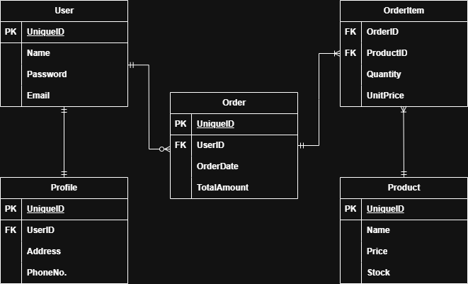
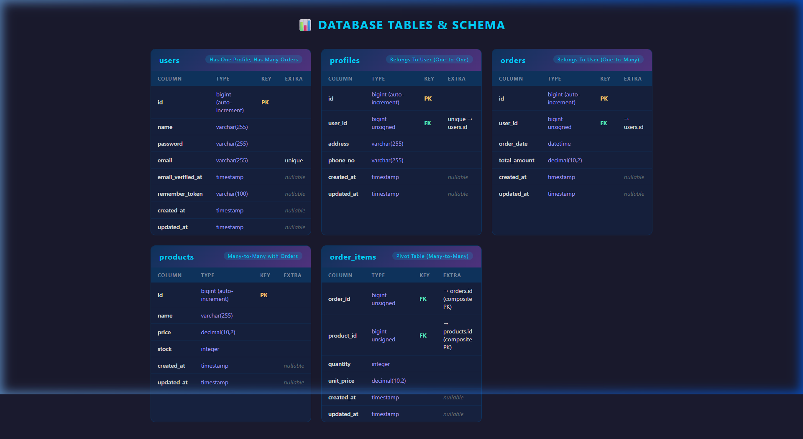
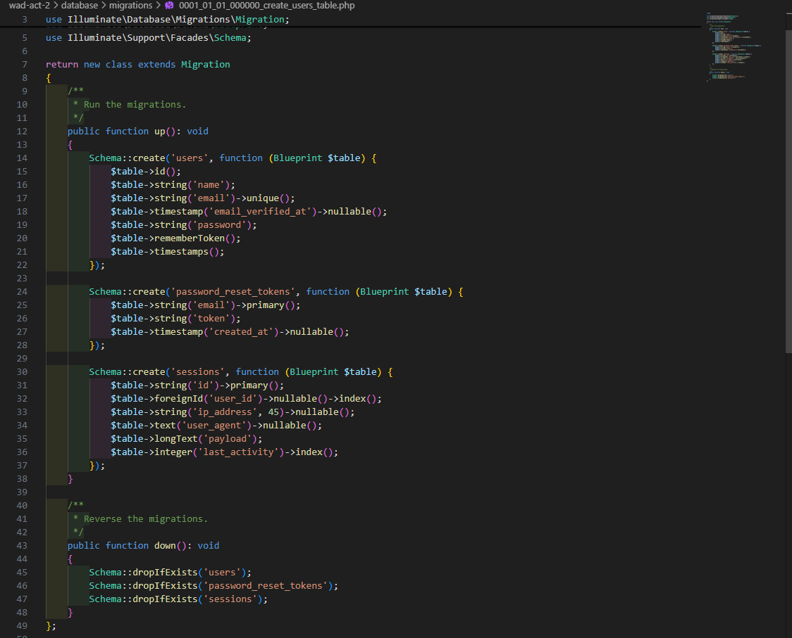
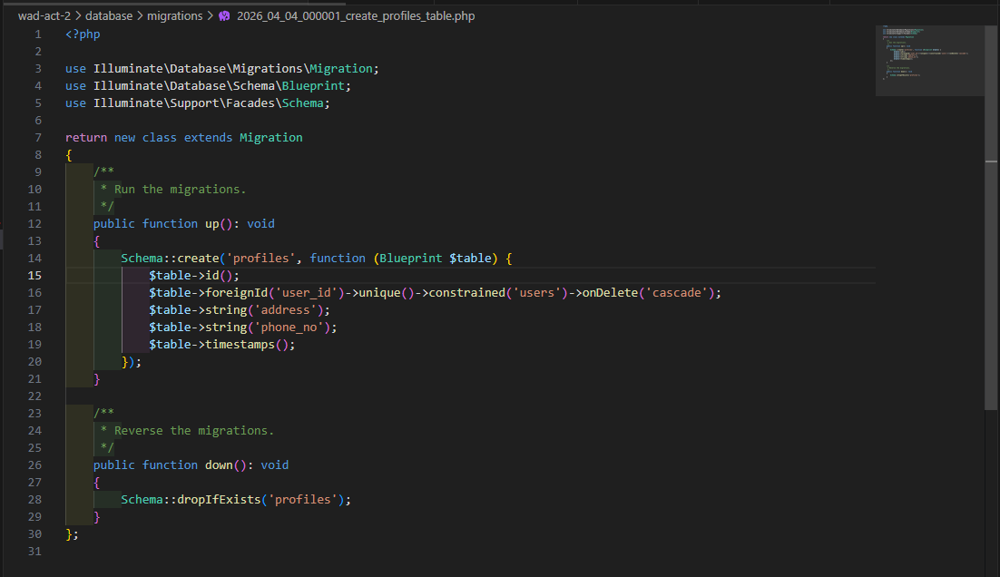
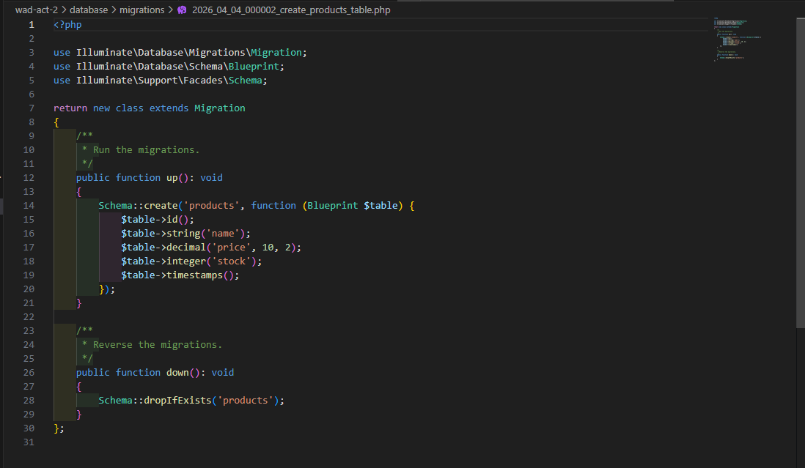
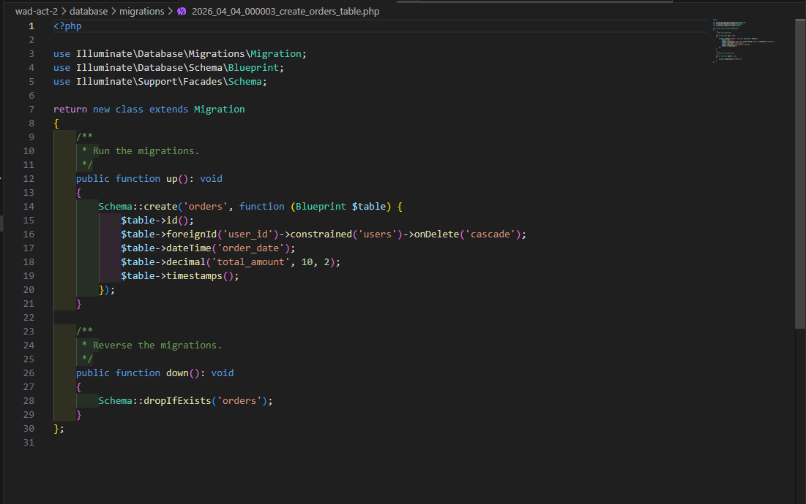
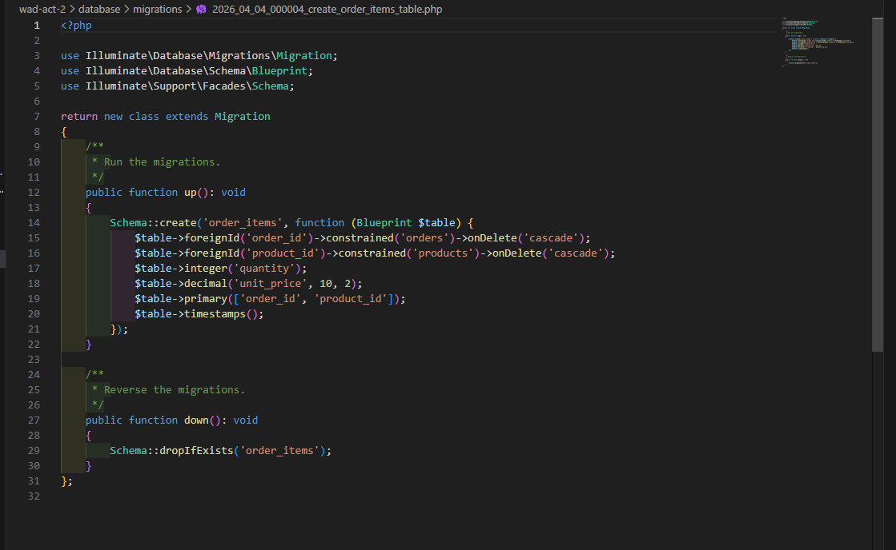

# WAD Activity 2 — Laravel Database Relationships

An e-commerce and management application built with **Laravel 12** demonstrating the three fundamental types of database relationships: **One-to-One**, **One-to-Many**, and **Many-to-Many**, now complete with full-stack CRUD, authorization, and UI views.

---

## 📐 Entity-Relationship Diagram (ERD)

The database design for this project illustrates fundamental relationships and includes eight core entities linked through foreign keys and pivot tables.


### Tables at a Glance

| Table | Primary Key | Description |
|-------|------------|-------------|
| **User** | `id` | Stores user account information (name, email, password) |
| **Profile** | `id` | Stores additional user details (address, phone number) |
| **Order** | `id` | Records purchase orders placed by users |
| **Product** | `id` | Catalog of products available for purchase |
| **OrderItem** | `order_id, product_id` (composite) | Pivot table linking orders to products |

---

## 🔗 Database Relationships Explained

### 1. One-to-One: `User` ↔ `Profile`

**What does One-to-One mean?**

A **One-to-One** relationship means that one record in a table is associated with **exactly one** record in another table, and vice versa. In our case:

- Each **User** has **exactly one** Profile
- Each **Profile** belongs to **exactly one** User

**Why is this One-to-One?**

The key is the **`unique` constraint** on the `user_id` foreign key in the `profiles` table. This `unique()` constraint guarantees that no two profiles can reference the same user — ensuring each user can only ever have one profile.

```php
$table->foreignId('user_id')->unique()->constrained('users')->onDelete('cascade');
```

If we removed the `unique()` constraint, it would become a One-to-Many relationship (one user could have multiple profiles). The `unique` constraint is what enforces the "one" on both sides.

**How it works in Laravel (Eloquent):**

```php
public function profile(): HasOne
{
    return $this->hasOne(Profile::class);
}

public function user(): BelongsTo
{
    return $this->belongsTo(User::class);
}
```

**Usage Example:**

```php
$user = User::find(1);
$address = $user->profile->address;

$profile = Profile::find(1);
$name = $profile->user->name;
```

**Real-world analogy:** Think of it like a person and their passport — each person has exactly one passport, and each passport belongs to exactly one person.

---

### 2. One-to-Many: `User` ↔ `Order`

**What does One-to-Many mean?**

A **One-to-Many** relationship means that one record in a table can be associated with **multiple** records in another table, but each of those records only belongs to **one** record in the first table. In our case:

- One **User** can place **many** Orders
- Each **Order** belongs to **only one** User

**Why is this One-to-Many?**

The `orders` table has a `user_id` foreign key, but unlike the `profiles` table, it does **NOT** have a `unique` constraint. This means multiple orders can reference the same `user_id`, allowing one user to have many orders.

```php
$table->foreignId('user_id')->constrained('users')->onDelete('cascade');
```

**The difference from One-to-One:**

| Aspect | One-to-One (Profile) | One-to-Many (Order) |
|--------|---------------------|---------------------|
| Foreign Key | `user_id` with `unique()` | `user_id` without `unique()` |
| Meaning | Only 1 profile per user | Many orders per user |
| Laravel Method | `hasOne()` | `hasMany()` |

**How it works in Laravel (Eloquent):**

```php
public function orders(): HasMany
{
    return $this->hasMany(Order::class);
}

public function user(): BelongsTo
{
    return $this->belongsTo(User::class);
}
```

**Usage Example:**

```php
$user = User::find(1);
$orders = $user->orders;
echo $user->orders->count();

$order = Order::find(1);
$userName = $order->user->name;
```

**Real-world analogy:** Think of a teacher and their students — one teacher can have many students, but each student is assigned to one teacher (in a given class).

---

### 3. Many-to-Many: `Order` ↔ `Product` (via `OrderItem`)

**What does Many-to-Many mean?**

A **Many-to-Many** relationship means that records in both tables can be associated with **multiple** records in the other table. In our case:

- One **Order** can contain **many** Products
- One **Product** can appear in **many** Orders

**Why can't we directly connect Order and Product?**

This is the most important question! Here's why we need a **pivot table** (`order_items`):

**❌ The problem with a direct connection:**

If we tried to put a `product_id` directly in the `orders` table:

```
orders table:
| id | user_id | product_id | order_date |
| 1  | 1       | ???        | 2026-04-04 |  ← What if the order has 3 products?
```

We would need to either:
- Create **multiple rows** for the same order (duplicating order data) — BAD!
- Put **multiple product IDs** in one column (like `"1,2,3"`) — TERRIBLE! Can't query, can't enforce foreign keys, can't join.

Similarly, if we put an `order_id` in the `products` table:

```
products table:
| id | name   | order_id |
| 1  | Laptop | ???      | ← What if this product is in 50 different orders?
```

Same problem — a product would need 50 rows just because it was ordered 50 times.

**✅ The solution: Pivot Table (`order_items`)**

The `order_items` table sits **between** `orders` and `products` and stores:
- Which **order** contains which **product** (the relationship itself)
- **Extra data** about that specific combination: `quantity` and `unit_price`

```
order_items table:
| order_id | product_id | quantity | unit_price |
| 1        | 1          | 1        | 999.99     |  ← Order 1 has 1 Laptop
| 1        | 2          | 2        | 29.99      |  ← Order 1 has 2 Mice
| 2        | 2          | 3        | 29.99      |  ← Order 2 has 3 Mice
| 3        | 1          | 1        | 999.99     |  ← Order 3 has 1 Laptop
```

Now we can see:
- **Order 1** contains Laptop + Mouse (one order → many products ✓)
- **Product 2 (Mouse)** appears in Order 1 and Order 2 (one product → many orders ✓)
- Each row can store **how many** and **at what price** — data that only makes sense in the context of a specific order-product combination

**The pivot table migration:**

```php
Schema::create('order_items', function (Blueprint $table) {
    $table->foreignId('order_id')->constrained('orders')->onDelete('cascade');
    $table->foreignId('product_id')->constrained('products')->onDelete('cascade');
    $table->integer('quantity');
    $table->decimal('unit_price', 10, 2);
    $table->primary(['order_id', 'product_id']);  // Composite primary key
    $table->timestamps();
});
```

The **composite primary key** `['order_id', 'product_id']` ensures that the same product can't be added to the same order twice (you'd update the quantity instead).

**How it works in Laravel (Eloquent):**

```php
public function products(): BelongsToMany
{
    return $this->belongsToMany(Product::class, 'order_items')
                ->withPivot('quantity', 'unit_price')
                ->withTimestamps();
}

public function orders(): BelongsToMany
{
    return $this->belongsToMany(Order::class, 'order_items')
                ->withPivot('quantity', 'unit_price')
                ->withTimestamps();
}
```

**Usage Example:**

```php
$order = Order::find(1);
foreach ($order->products as $product) {
    echo $product->name;
    echo $product->pivot->quantity;
    echo $product->pivot->unit_price;
}

$order->products()->attach($productId, [
    'quantity' => 2,
    'unit_price' => 29.99,
]);

$product = Product::find(1);
$orders = $product->orders;
```

**Real-world analogy:** Think of students and courses — one student can enroll in many courses, and one course can have many students. The "enrollment" table (pivot) stores the specific grade and semester for each student-course combination.

---

## 📊 Database Schema

The screenshot below shows the actual database tables created by our migrations, including their columns, data types, primary keys (PK), foreign keys (FK), and constraints.



---

## 📁 Migration Files

The following screenshots show the migration files that define our database schema:

### 1. Users Table Migration


### 2. Profiles Table Migration (One-to-One)


### 3. Products Table Migration (Many-to-Many Entity)


### 4. Orders Table Migration (One-to-Many)


### 5. Order Items Table Migration (Many-to-Many Pivot)


---

## ✨ Full-Stack Features Added

Beyond just database relationships, the application now includes:
- **Authentication System**: Secure user registration, login, and robust session management.
- **Admin Middleware**: Role-based access control protecting critical routes and administrative actions.
- **Full-Stack CRUD Views**: Blade-templated UI to Create, Read, Update, and Delete records for `Products`, `Orders`, and `Customers`.
- **Search & Filtering**: Integrated search capabilities on the index views for quick data discovery.
- **Enhanced Data Models**: Continued schema improvements, including `Posts` and `Tags` with many-to-many structures.

---

## 🗃️ Relationship Summary

```
┌──────────────────────────────────────────────────────────────────┐
│                    RELATIONSHIP OVERVIEW                         │
├──────────────────────────────────────────────────────────────────┤
│                                                                  │
│  ┌──────────┐  1:1   ┌──────────┐                                │
│  │   User   │────────│  Profile │    One-to-One                  │
│  └──────────┘        └──────────┘    (unique FK)                 │
│       │                                                          │
│       │ 1:N                                                      │
│       │                                                          │
│  ┌──────────┐  M:N   ┌──────────┐                                │
│  │  Order   │─┐    ┌─│  Product │    Many-to-Many                │
│  └──────────┘ │    │ └──────────┘    (pivot table)               │
│               │    │                                             │
│           ┌──────────┐                                           │
│           │OrderItem │    Pivot table with                       │
│           │ (pivot)  │    quantity & unit_price                  │
│           └──────────┘                                           │
│                                                                  │
└──────────────────────────────────────────────────────────────────┘
```

| Relationship | Tables | Type | How It's Enforced |
|-------------|--------|------|-------------------|
| User ↔ Profile | `users` → `profiles` | **One-to-One** | `user_id` FK with `unique()` constraint |
| User ↔ Orders | `users` → `orders` | **One-to-Many** | `user_id` FK without unique constraint |
| Order ↔ Product | `orders` ↔ `products` | **Many-to-Many** | `order_items` pivot table with composite PK |

---

## 🚀 Setup Instructions

```bash
# 1. Install dependencies
composer install

# 2. Copy environment file
cp .env.example .env

# 3. Generate application key
php artisan key:generate

# 4. Run migrations (creates the SQLite database)
php artisan migrate

# 5. Start the development server
php artisan serve
```

---

## 📂 Project Structure (Key Files)

```
app/Models/
├── User.php
├── Profile.php
├── Order.php
├── Product.php
└── OrderItem.php

app/Http/Controllers/
├── AuthController.php
├── CustomerController.php
├── DashboardController.php
├── OrderController.php
└── ProductController.php

app/Http/Middleware/
└── AdminMiddleware.php

resources/views/
├── auth/
├── customers/
├── layouts/
├── orders/
└── products/

database/migrations/
├── 0001_01_01_000000_create_users_table.php
├── 2026_04_04_000001_create_profiles_table.php
├── 2026_04_04_000002_create_products_table.php
├── 2026_04_04_000003_create_orders_table.php
└── 2026_04_04_000004_create_order_items_table.php
```

---

## 🛠️ Tech Stack

- **Framework:** Laravel 12
- **Database:** SQLite
- **Language:** PHP 8.x
- **ORM:** Eloquent
